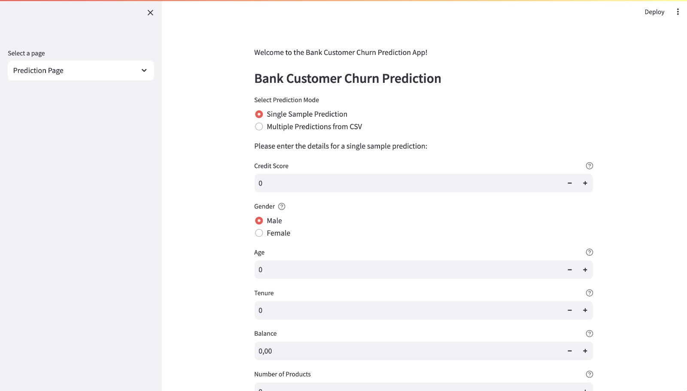
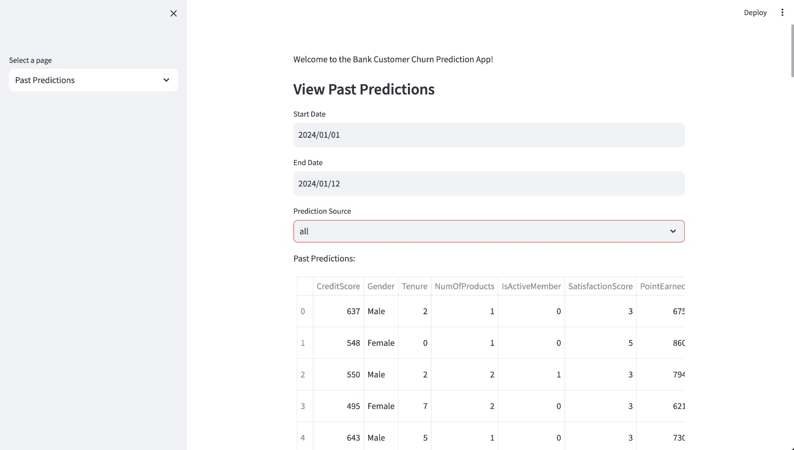
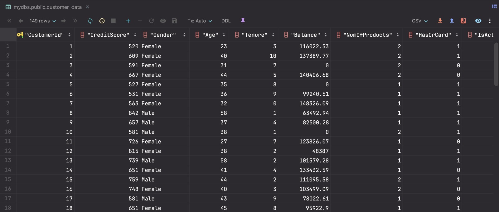
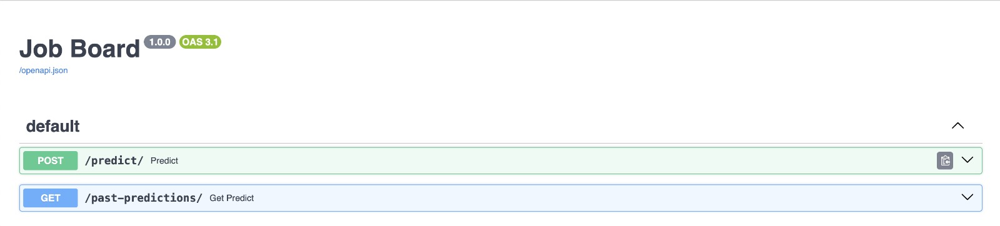
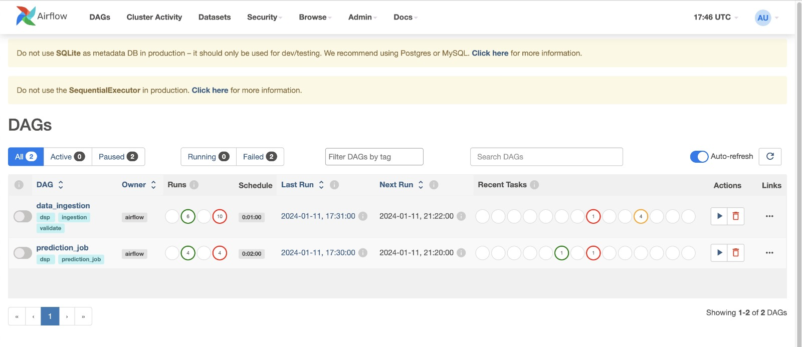

# Data Science in Production Project: Customer Bank Churn Prediction

#### Collaborators
- Khanh Duong Tran
- Brandon Nguelewi Toutsap
- Massinissa Zekrini
- Mohammad Solgi
- Safwan Ullah Khan

Welcome to our immersive journey in Data Science! In this project, we delve into the dynamic landscape of Customer Bank Churn Prediction, combining the prowess of Machine Learning (ML) with cutting-edge technologies to empower banks in anticipating and mitigating customer attrition.

## Project Overview

In today's competitive banking industry, understanding and predicting customer behavior are paramount. The ability to foresee when a customer might decide to part ways with a bank provides an invaluable opportunity for proactive engagement and retention strategies. Our project centers around the development of a sophisticated ML-driven application, acting as a predictive model for banks to identify potential churn factors and take preemptive actions.

## Anticipating Customer Churn

Customer churn, the phenomenon where individuals cease using a company's services, is a critical metric that directly impacts recurring revenue. Our mission is to unravel the intricacies of this phenomenon within the banking sector. By leveraging advanced ML algorithms, we aim to create a powerful tool that not only predicts customer churn but also equips banks with actionable insights to foster customer loyalty.

## Dataset Exploration

The Dataset can be found here: [Bank Customer Churn](https://www.kaggle.com/datasets/radheshyamkollipara/bank-customer-churn). 
- The dataset encompasses information about clients from a particular bank, detailing their usage of banking services. 
- It serves as the foundation for our analysis and the construction of our Churn prediction model. 
- It comprises 17 features alongside a target column, totaling 10,000 records. 

Further details regarding each column can be found in the description section on Kaggle.

## Main technologies

Embark on a journey through the core components of our project:

- **User Interface (UI): Streamlit:** Experience a user-friendly interface where predictions are made effortlessly, with a focus on both single predictions and batch predictions from CSV files.

  
- **Model Service (API): FastAPI:** Our go-to solution for exposing the ML model, handling predictions, and seamlessly interacting with the web application.

- **Database: PostgreSQL, SQLAlchemy:** The reliable keeper of records, storing past predictions and diligently tracking data quality issues.

- **Data Ingestion Job: Airflow, Great Expectations:** A continuous process that hungers for fresh data, ensuring its quality and reliability for our predictive model.

- **Prediction Job: Airflow:** The automaton of predictions, scanning for new data and orchestrating the forecasting process every two minutes.

- **Monitoring Dashboard: Grafana:** A vigilant guardian, monitoring data quality and model prediction issues through insightful charts.

## Installation and Setup

1. **Initial Installation:**
Install project dependencies:
   - pip install -r requirements.txt

2. **Install Docker and Docker Compose**

3. **Build Docker image and start services:**
-  docker build -f dockerfile -t dsp-final-airflow:latest . && docker-compose -f "docker-compose.yml" up -d --build

4. **Modify the Airflow configuration file:**
- Open airflow.cfg.
- Find and modify the following line: enable_xcom_pickling = True

### Running Steps:
1. **Run the FastAPI main.py file for the API:**
uvicorn main:app --reload

2. **Run the Streamlit app.py file for the webapp:**
streamlit run app.py

### Accessing Frontend:
For the webapp, go to localhost:8501.8

### Accessing Airflow:
- Go to localhost:8080.
- Retrieve the Airflow admin password from the standalone_admin_password file, and use the username admin.

